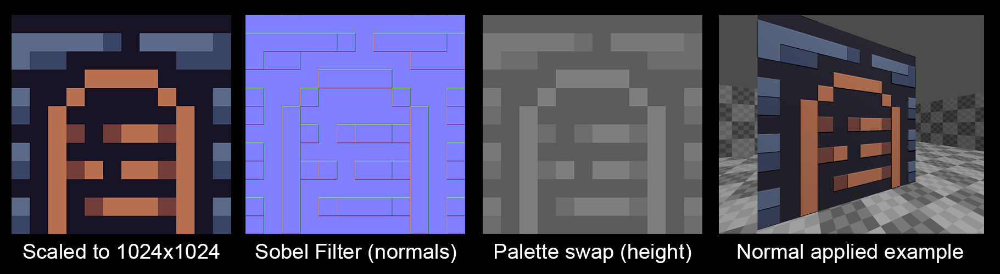
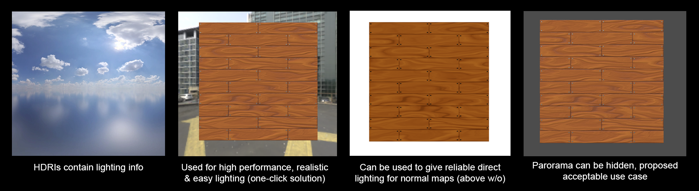
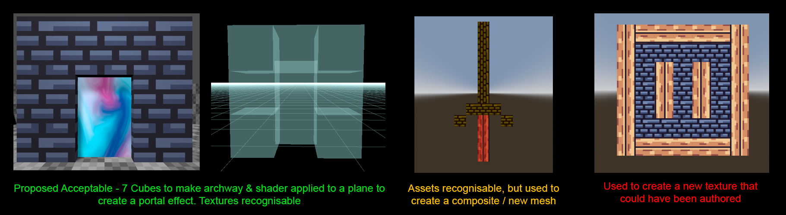

# 3D Rules Ideas

The 2D rules we have established allow for relatively clearcut examples and practices for destructively altering (cutting / compositing etc) the provided assets in a way that satisfies the rules. We haven't yet established what methods can be used to enhance the assets in a 3D scene.

This has already caused some 'drama' in the game-jam channel, and it is the opinion of some community members that not being allowed to destructively alter meshes is 'not game development'. I (Slip) disagree, and think the rules are more than expansive enough, but perhaps we need some clarity on which 3D practices and techniques are and aren't allowed.

Here are some edge cases / examples to get the ball rolling.

## Normal Maps

Normal maps can be easily generated procedurally from the provided assets, and give informtation to the engine about how to light an object to give the appearance of depth. I propose that their use are acceptable provided they are authored from the provided assets and used only for that purpose; for example it is not permitted to use a normal map as another colour texture.

## HDRIs

HDRIs are a panoramic photos that contain high dynamic range light and colour data. They can be used by engines to full light a scene with realistic lighting. This is a one-click solution that removes substantial burden for lighting a 3D scene. The questionable issue occures in that they are an external texture.

(Slip) I propose that we allow the use of these maps, much like normals, under the proviso that they are only used for their lighting data and that the panorama is never seen.

## Composite Meshes

Primitve meshes are allowed in the rules, primarily to create walls & floors. However there might be some scope for them to be used to block out slightly more interesting features.

(Slip) I propose that we essentially follow the 2D rules on this, that composites are permitted provided they are recognisable from the given assets. There are however some very grey areas here as to how far one might be allowed to take this.

I've run out of time here, there are many many more edge cases; especially around the use of particle and shaders, but I believe we have spoken about these already to establish some rules.

## Meshes With Deformation

These include things that can be done with shader effects such as displacement mapping, even if no new meshes were modeled.

Example made by Arlorean with a mesh, seems like it keeps with the "original asset must always still be recognizable" spirit and encourages creativity within the limitations?
