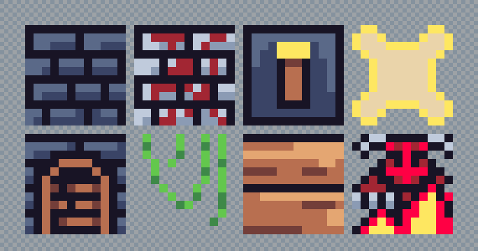
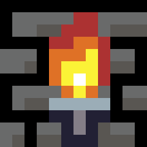

# Art Style Guide
We welcome art from anybody that wants to contribute to the jam! We're going to collect art tiles to make a large tileset right up until the jam starts. Once it starts we will all have access to the same sets of tiles. So if you want to contribute please create a folder in `assets/tiles/<your name>/` and place your art assets in there. This document covers the details of how to make the assets.

## Basic ideas
The style is to have 12x12 pixel images that include walls, monsters, floor, ceiling, objects in the world, UI elements, etc. Everything. Here are some examples:

Here are a couple screenshots of the assets in Jimbly's engine:

A couple things to notice about the tiles:
* The tiles are generally shaded with 1, 2 or 3 tones. This means if you have a brick it might be 1, 2 or 3 shades of grey. Most tiles will have 2 tones for most things. Notice the switch (tile 3) has a single tone for the handle but 2 tones for the brown and grey parts. The wood in tile 7 is 3 tones, this is just an aesthetic choice. More tones add detail, fewer tones tend to make things look more flat.
* A wall tile is floor to ceiling
* A ground tile covers a full cell a player can walk on
* The monsters are also 12x12 (as is everything)
* Everything is a 24-bit color `.png`. Transparency is transparent - we won't be using a reserved color for transparent. If you want to use hot pink for transparent then use `0xFF00FF` and we'll just replace it with transparent before the jam starts.
## Palette
We want to use a limited and consistent palette. To this end we are authoring all the art tiles with the same palette which is the [Lospec Endesga-32 palette](https://lospec.com/palette-list/endesga-32). In the jam you can alter the palette to look like whatever you want but it's important to keep all the original tiles using the same 32 colors.

When the jam starts you can replace all the colors to whatever you want. You can replace them down to 4 CGA colors if you want, or change the colors during play, whatever. But please author the art using only these colors + transparent.
## Animations
Animations are cool. You don't have to animate anything but we're going to try and create animation frames for things that will look good animated, and 4 frames for monsters. The monsters will have:
* 2 idle frames
* 1 attack frame
* 1 taking damage frame

The way to create the frames is as separate tiles. No need to create an animated `.GIF` or anything, just make multiple files and people can animate it in code.

If you don't want to create all 4 frames for a monster but have a cool idea for one that's fine - just make 1 and somebody will probably just fill in the other frames 4 you (at least one person has offered to do so). Also you are under no obligation to use all of the frames in your game, this is just a convention we intend to target.

For non-monster things 2 frames is probably fine but if you want to create more then go for it! Of course many things (probably most things) won't be animated at all - no need to animate every single wall or floor tile.

It's also fine to create multiple states of the same thing. For example a closed chest, and opened chest, a destroyed chest, etc. Just create them as different tiles.

**Sample 2 frame animations**

**Sample 4 frames for an enemy**

## Conclusion
This should be it! Basically is long as you create a bunch of images that are 12x12 with the Endesga-32 palette they should be fine. Create as many as you want, we'll combine them all in a sane and logical way at the last minute before the jam starts :)